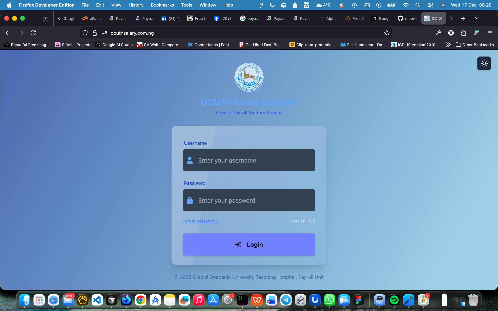
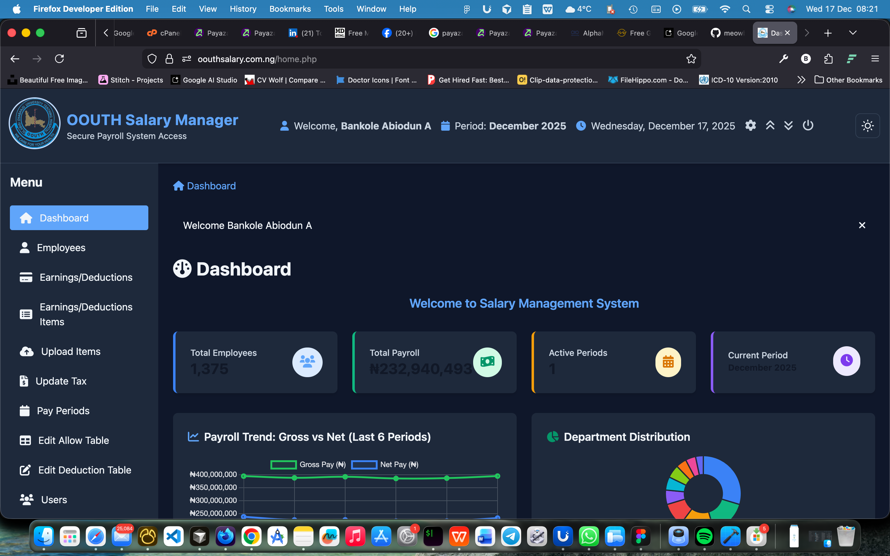

<div align="center">

# OOUTH Payroll & Staff Management Portal

[](https://www.php.net/)
[](https://www.mysql.com/)
[](https://jquery.com/)
[]()

**The central administrative hub for managing OOUTH staff salaries, pensions, and records.**
Handles complex payroll computations, automated backups, and PDF reporting.

[**Visit Portal**](https://oouthsalary.com.ng/)

</div>

---

## 📸 Dashboard Preview

| Admin Dashboard | Payroll Processing | Staff Records | PDF Reports |
|:---:|:---:|:---:|:---:|
|  |  |  |  |

---

## 🚀 Key Features

### 💰 Payroll Engine
*   **Automated Computations:** Calculates CONHESS/CONMESS scales, tax deductions, and allowances automatically.
*   **Excel Import:** Bulk upload staff data and salary adjustments via Excel (`excel_import/`).
*   **Payslip Generation:** Generates individual PDF payslips for thousands of staff in seconds.
*   **Multi-Period Processing:** Handle multiple pay periods with batch processing capabilities.
*   **Grade & Step Management:** Automated salary calculations based on CONHESS/CONMESS scales.

### 🛡️ System Administration
*   **Automated Backups:** Built-in SQL backup tools (`backup/`) to prevent data loss.
*   **Role-Based Access Control:** Secure login with distinct permissions for HR, Audit, and Super Admins.
*   **Audit Trail:** Tracks changes to sensitive salary data with complete change history.
*   **User Management:** Comprehensive user creation, permission management, and access control.

### 📊 Reporting & Analytics
*   **Dynamic Reporting:** Real-time generation of pension reports, bank schedules, and tax summaries.
*   **PDF Generation:** Professional PDF reports using MPDF and TCPDF libraries.
*   **Excel Export:** Export payroll data, staff lists, and reports to Excel format.
*   **Abeokuta Variance Tracking:** Monitor salary submissions and track changes over time.
*   **Monthly Comparison Reports:** Compare payroll data across different periods.

### 📧 Communication & Notifications
*   **Email System:** Automated email notifications for payslips and official announcements (`sendmail/`).
*   **Bulk Email:** Send payslips and notifications to multiple staff members simultaneously.
*   **Email Templates:** Customizable email templates for different notification types.

### 🔌 API & Integration
*   **REST API:** Enterprise-grade REST API for payroll data integration (`api/`, `auth_api/`).
*   **JWT Authentication:** Secure token-based authentication for API access.
*   **Webhook System:** Real-time event notifications for payroll processing and updates.
*   **Multi-format Support:** JSON, XML, and CSV response formats.
*   **Rate Limiting & Security:** 6-layer security system with IP whitelisting and audit logging.

### 👥 Staff Management
*   **Employee Records:** Complete staff database with profile management.
*   **Department Management:** Organize staff by departments and units.
*   **Bank Account Management:** Handle staff bank account details for salary payments.
*   **PFA (Pension Fund Administrator) Management:** Track pension contributions and PFAs.
*   **Status Tracking:** Monitor staff employment status (active, suspended, retired, etc.).

---

## 🛠️ Tech Stack
*   **Backend:** Native PHP 8.2+ (Object-Oriented Architecture)
*   **Database:** MySQL
*   **Frontend:** HTML5, CSS3, JavaScript (jQuery, DataTables)
*   **Libraries:**
    *   PhpSpreadsheet (Excel import/export)
    *   PHPMailer (Email notifications)
    *   MPDF & TCPDF (PDF generation)
    *   DotEnv (Configuration management)

---

## 🔧 Installation (Local Dev)

### Prerequisites
*   PHP 8.2 or higher
*   MySQL 5.7+ or MariaDB 10.3+
*   Apache/Nginx web server (or PHP built-in server)
*   Composer (for dependency management)

### Setup Steps

1.  **Clone the repository**
    ```bash
    git clone https://github.com/meowbanky/oouth_salary.git
    cd oouth_salary
    ```

2.  **Install Dependencies**
    ```bash
    composer install
    ```

3.  **Configure Database**
    *   Create a MySQL database named `oouth_salary` (or your preferred name).
    *   Import the SQL file from the `backup/` folder (if available).
    *   Update database credentials in `Connections/` directory or `.env` file.

4.  **Configure Environment**
    *   Copy `.env.example` to `.env` (if available) or update configuration files directly.
    *   Set database connection details.
    *   Configure email settings for notifications.

5.  **Run the Server**
    
    **Option A: PHP Built-in Server**
    ```bash
    php -S localhost:8000
    ```
    
    **Option B: Apache/Nginx**
    *   Configure virtual host pointing to the project root.
    *   Ensure mod_rewrite is enabled (if using URL rewriting).

6.  **Access the Portal**
    *   Navigate to `http://localhost:8000` (or your configured domain).
    *   Login with admin credentials.

---

## 📁 Project Structure

```
oouthsalary/
├── api/                      # REST API endpoints
│   ├── v1/                  # API version 1
│   ├── auth/                # Authentication handlers
│   └── middleware/          # Rate limiting, validation
├── auth_api/                # Mobile app API endpoints
│   ├── api/                 # API routes
│   └── lib/                 # Libraries (TCPDF, etc.)
├── excel_import/            # Excel import functionality
├── backup/                  # Database backup scripts
├── sendmail/                # Email sending system
├── report/                  # Report generation modules
├── classes/                 # PHP classes and utilities
├── Connections/             # Database connection files
├── config/                  # Configuration files
├── assets/                  # CSS, JS, images
├── download/                # Mobile app download files
└── screenshots/             # Portal screenshots (to be added)
```

---

## 🔐 Security Features

*   **Password Hashing:** Secure password storage using PHP password_hash()
*   **Session Management:** Secure session handling with CSRF protection
*   **SQL Injection Prevention:** Prepared statements and parameterized queries
*   **XSS Protection:** Input sanitization and output escaping
*   **Role-Based Access:** Granular permission system
*   **API Security:** JWT tokens, HMAC signing, rate limiting, IP whitelisting
*   **Audit Logging:** Complete audit trail for sensitive operations

---

## 📚 Documentation

*   [API Documentation](api/README.md) - REST API endpoints and usage
*   [Backup System](BACKUP_README.md) - Automated backup procedures
*   [Abeokuta Variance Tracking](ABEOKUTA_VARIANCE_TRACKING_README.md) - Variance tracking system
*   [Monthly Comparison Reports](MONTHLY_COMPARISON_REPORT_README.md) - Report generation guide

---

## 🌐 Production Deployment

**Live Portal:** https://oouthsalary.com.ng/

**API Endpoints:**
*   API Base: `https://oouthsalary.com.ng/api/v1/`
*   Mobile API: `https://oouthsalary.com.ng/auth_api/`
*   Admin Dashboard: `https://oouthsalary.com.ng/api_management.php`

---

## 🐛 Troubleshooting

### Common Issues

**Database Connection Errors:**
*   Verify database credentials in `Connections/` or `.env` file
*   Ensure MySQL service is running
*   Check database user permissions

**PDF Generation Issues:**
*   Verify MPDF/TCPDF libraries are installed via Composer
*   Check file permissions for PDF output directory
*   Ensure sufficient memory limit in `php.ini`

**Email Not Sending:**
*   Verify SMTP settings in email configuration
*   Check PHPMailer library installation
*   Review server mail logs

**Excel Import Errors:**
*   Ensure PhpSpreadsheet is installed: `composer require phpoffice/phpspreadsheet`
*   Check file upload permissions
*   Verify Excel file format matches template

---

## 📝 License

Copyright © OOUTH Payroll & Staff Management System. All rights reserved.

This is proprietary software developed for Olubisi Onabanjo University Teaching Hospital.

---

## 📞 Support

For issues or questions:
*   Check the troubleshooting section above
*   Review API and system documentation
*   Contact the development team

---

**Built with ❤️ for OOUTH Staff Management**
